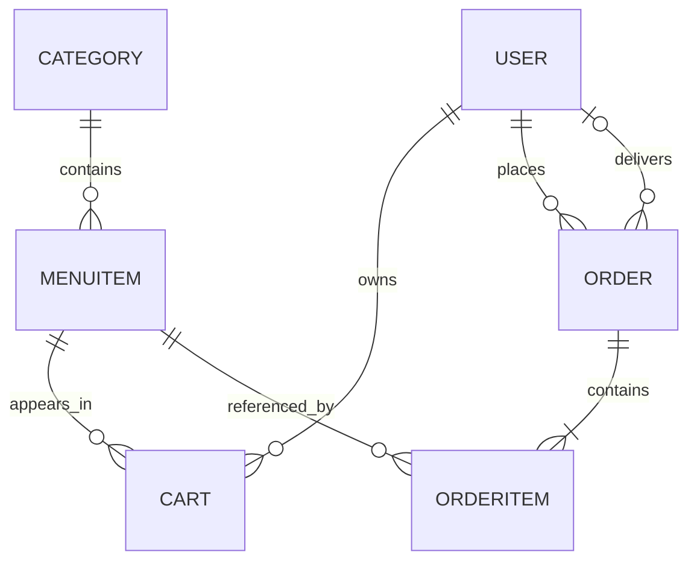

# Little Lemon API — Design Document

**Companion to:** `01 SRS - Software Requirements Specification.md`
**Version:** 1.2
**Reviewed:** 2026-09-23
**Status:** Implementation design; no application code has been created

The SRS owns the behavioral contract. Code sketches here explain implementation choices; the build plan introduces them incrementally.

---

## 1. Architecture Overview

```text
HTTP request
  → Django URL resolution
  → DRF authentication → permissions → throttling
  → view method → scoped queryset / input serializer
  → business operation → Django ORM → SQLite
  → response serializer → JSON or development browsable API
```

DRF performs authentication and permission checks before throttling and dispatching the method handler. These are APIView checks, not three separate Django middleware layers. A missing token on a protected route normally produces 401 before any throttle check. Test 405 with an authenticated, permitted caller and available quota. Content negotiation and parsing can also produce framework errors. See [DRF request lifecycle source](https://github.com/encode/django-rest-framework/blob/master/rest_framework/views.py).

### 1.1 Technology choices

| Component | Choice |
|---|---|
| Framework | Prefer Django 5.2 LTS, with compatible DRF, Djoser and django-filter releases; confirm Python and course constraints in Step 0 |
| Authentication | DRF `TokenAuthentication`, `rest_framework.authtoken`, Djoser registration/login |
| Database | SQLite for sequential local coursework |
| Dependencies | Pipenv; commit the resolved `Pipfile.lock` |
| Testing | Django test runner and DRF `APITestCase`; query-count checks |
| Profiling | Optional development-only Django Debug Toolbar |

Do not pin Django 4.x solely because the earlier draft called it a project constraint. Verify actual course requirements and use a supported compatible release where possible. [Django supported releases](https://www.djangoproject.com/download/).

### 1.2 Intended structure

```text
26. Final Project/
├── .github/                     # issue/PR templates; CI after Step 0
├── .gitignore
├── README.md
├── 01 SRS - Software Requirements Specification.md
├── 02 Design Document.md
├── 03 Build Plan.md
└── LittleLemon/
    ├── Pipfile
    ├── Pipfile.lock
    ├── manage.py
    ├── LittleLemon/
    │   ├── settings.py
    │   └── urls.py
    └── LittleLemonAPI/
        ├── models.py
        ├── serializers.py
        ├── permissions.py
        ├── views.py
        ├── services.py          # cart writes, checkout and role changes
        ├── filters.py
        ├── pagination.py
        ├── admin.py
        ├── urls.py
        ├── migrations/
        ├── templates/LittleLemonAPI/login.html
        └── tests/
            ├── __init__.py
            ├── test_auth.py
            ├── test_models.py
            ├── test_permissions.py
            ├── test_menu.py
            ├── test_groups.py
            ├── test_cart.py
            ├── test_orders.py
            └── test_queries.py
```

The existing project folder will be the repository root, keeping the planning documents and application together. `.github/`, README and `.gitignore` belong at that root; application commands run inside `LittleLemon/`. Confirm this layout against the user's existing remote before setup; preserve any remote history.

Create modules only when their step needs them. Replace Django's generated `tests.py` with the `tests/` package during scaffold setup, so the test harness is ready before the first feature. Keep one Django app; a few small helper modules do not require extra apps.

---

## 2. Data Model

### 2.1 Relationships



The service guarantees at least one item per placed order; an FK alone does not enforce that minimum.

### 2.2 Model specifications

Use `settings.AUTH_USER_MODEL` for foreign keys and `get_user_model()` in runtime code. The built-in Django User is sufficient; no custom user model is needed.

| Model | Fields and constraints |
|---|---|
| `Category` | `slug`: unique SlugField; `title`: CharField(255), indexed |
| `MenuItem` | `title`: CharField(255), indexed; `price`: DecimalField(6,2), indexed; `featured`: BooleanField(default=False); `category`: FK(Category, PROTECT) |
| `Cart` | `user`: FK(User, CASCADE); `menuitem`: FK(MenuItem, CASCADE); `quantity`: PositiveSmallIntegerField; `unit_price`: DecimalField(6,2); `price`: DecimalField(12,2) |
| `Order` | `user`: FK(User, PROTECT, related_name='orders'); `delivery_crew`: FK(User, SET_NULL, null=True, blank=True, related_name='assigned_orders'); `status`: BooleanField(default=False), indexed; `total`: DecimalField(12,2); `date`: DateField(default=timezone.localdate), indexed |
| `OrderItem` | `order`: FK(Order, CASCADE, related_name='items'); `menuitem`: FK(MenuItem, PROTECT); `quantity`: PositiveSmallIntegerField; `unit_price`: DecimalField(6,2); `price`: DecimalField(12,2) |

Use named `UniqueConstraint` entries for Cart `(user, menuitem)` and OrderItem `(order, menuitem)`. Add database check constraints for quantity 1–100 and nonnegative money. Enforce the unit-price ceiling of 9999.99 in validation and database checks. Serializer validation must reject invalid values before writes; SQLite does not reliably enforce decimal precision solely from the field declaration.

A maximum unit price of 9999.99 × 100 units × 100 cart lines gives 99,999,900.00. `DecimalField(6,2)` cannot hold even many legitimate line totals; `DecimalField(12,2)` can hold the bounded totals. Always calculate with Decimal, never float.

Cart line count, price multiplication and order-total consistency are service invariants. `bulk_create()` does not call model `save()` or `full_clean()`, so validate and calculate before using it. Make derived financial fields read-only in admin and disable direct cart/order/order-item edits that bypass the services.

### 2.3 Deletion and history

- Category with menu items: `PROTECT` blocks deletion.
- Menu item referenced by an order item: `PROTECT`; API catches `ProtectedError` and returns 400 with a useful explanation. Cart-only rows cascade when an otherwise deletable menu item is removed.
- Order deletion by a manager: cascade its order items; do not restore the cart.
- Order owner deletion in admin: protected to retain order ownership.
- Delivery user deletion in admin: assignment becomes null; the order remains.

Snapshots preserve **quantity and monetary amounts**, not historical menu titles/categories. Nested menu information represents the current menu record. Historical descriptions or soft deletion would be a separate scope change.

### 2.4 Index rationale

Foreign keys are indexed automatically. Price and date indexes can assist range filters and sorting. Title indexes may assist ordering; an ordinary B-tree does not guarantee fast case-insensitive substring searches. Boolean indexes have limited selectivity; retain `Order.status` for the course model, but measure query plans before adding more indexes. Optimize ORM access patterns before speculative indexing.

---

## 3. Permission Design

### 3.1 One role resolver

Use one helper throughout permissions, order querysets and delivery assignment validation:

```text
unauthenticated                  → Anonymous
is_superuser OR Manager group    → Manager
Delivery crew group              → Delivery crew
otherwise                        → Customer
```

`is_staff` alone and unrelated groups do not change API roles. Manager precedence handles accidentally conflicting admin memberships predictably; API group writes reject such conflicts. Never implement Customer as `not user.groups.exists()`.

| Endpoint | Policy |
|---|---|
| Menu list/detail | `IsManagerOrReadOnly`: authenticated reads; Manager writes |
| Group routes | `IsManager` |
| Cart | `IsAuthenticated`, always caller-owned |
| Order list | `IsAuthenticated`; GET role-scoped; POST Customer only |
| Order detail | Role-scoped GET; Manager PUT/PATCH/DELETE; Delivery PATCH status only |

`IsManager` and `IsManagerOrReadOnly` must use the resolver so superusers work consistently. Configure `IsAuthenticated` globally and explicitly allow anonymous registration/login.

### 3.2 Object visibility

Build the order queryset before retrieving an object:

```text
Manager  → all orders
Delivery → filter(delivery_crew=request.user)
Customer → filter(user=request.user)
```

Apply this to list **and detail/update** views. An order outside the permitted queryset produces 404. Query parameters may narrow this queryset, never broaden it. Apply collection filters only on list views so unrelated query parameters cannot unexpectedly hide a detail resource.

Method permissions still apply first: a Customer DELETE returns 403 even if its target is outside the queryset. A Delivery PATCH to an unassigned order returns 404 before inspecting its fields.

### 3.3 Role assignment

Within a transaction, resolve the target user, check conflicting role membership, and add/remove only the requested role group. Preserve unrelated groups. New membership returns 201; existing membership returns 200. Removing a nonmember or unknown user returns 404. Missing/blank username returns 400; unknown username returns 404.

Before removing Delivery membership, reject with 400 if the user has pending assigned orders. Managers first reassign or unassign them. Superuser status is independent: removing a group cannot demote a superuser. First-time role groups are created in admin in Step 3; missing groups are setup errors to fix, not errors to disguise with a broad catch.

---

## 4. Serialization and Validation

### 4.1 Explicit input boundaries

| Operation | Accepted input | Output |
|---|---|---|
| Register | username, email, password | Public user fields; never password/privileges |
| Menu write | title, price, featured, category_id | id, title, price, featured, nested category |
| Group add | username | id, username, email |
| Cart add/replace | menuitem, quantity | id, user, menuitem, quantity, unit_price, price |
| Place order | Empty body or `{}` | Full order with nested items |
| Manager order update | delivery_crew, status | Full order |
| Delivery order update | status only | Full order |

Use dedicated input serializers where generic model serializers would obscure the allowed fields. Explicitly reject unknown or server-owned keys with 400, except Delivery's forbidden order fields, which return 403. Mark outputs read-only too; read-only fields alone normally ignore input rather than reject it.

Use `category_id = PrimaryKeyRelatedField(source='category', queryset=Category.objects.all(), write_only=True)` and a nested read-only `category`. Menu PUT requires all four writable fields even though creation defaults `featured` to false. Validate missing/invalid FK IDs as 400 field errors.

Order output fields: `id`, `user`, `delivery_crew`, `status`, `total`, `date`, `items`. Each item exposes `id`, nested `menuitem`, `quantity`, `unit_price`, `price`. Serialize money as decimal strings, status as a boolean and date as ISO `YYYY-MM-DD`.

### 4.2 Server-owned values

Pass the authenticated owner explicitly to the service, or use `serializer.save(user=request.user)` for a simple serializer create. A read-only `user` field with `CurrentUserDefault()` is **not** sufficient to insert the owner into `validated_data` for persistence. [DRF advanced defaults](https://www.django-rest-framework.org/api-guide/validators/#advanced-field-defaults).

Read the menu price server-side only when creating a cart row. Repeated POST replaces quantity and recalculates line price using the existing snapshot. The service handles upsert intentionally; an automatically generated uniqueness validator must not reject legitimate replacement requests. Keep the database uniqueness constraint.

### 4.3 Order updates

Manager PUT requires both editable fields; PATCH requires at least one. Delivery PATCH requires status and rejects all other keys. Accept only booleans or integer 0/1 for status, not arbitrary truthy strings. Validate delivery targets as active users resolving to Delivery crew; allow null. Ownership, items, date and amounts never change through this endpoint.

Either authorized role may set status to pending or delivered, including repeating the current value. This matches the existing status-editing scope without inventing an irreversible workflow. Manager can mark an unassigned order delivered.

---

## 5. Routes and Views

### 5.1 Exact authentication routes

Djoser's included URL patterns already contain `users/` or `token/login/`; prefixing them with those same paths duplicates path segments. Map only the actions required by the SRS explicitly. [Djoser endpoints and configuration](https://djoser.readthedocs.io/en/latest/getting_started.html).

Intended project URL mapping (imports omitted):

```python
urlpatterns = [
    path('admin/', admin.site.urls),
    path('api/users', RegistrationView.as_view({'post': 'create'}), name='register'),
    path('api/users/users/me/', CurrentUserView.as_view({'get': 'me'}), name='current-user'),
    path('token/login/', TokenCreateView.as_view(), name='token-login'),
    path('login/', login_page, name='login-page'),
    path('api/', include('LittleLemonAPI.urls')),
]
```

`RegistrationView` and `CurrentUserView` are small Djoser `UserViewSet` subclasses configured for their single action. Registration uses AllowAny and an extended Djoser create serializer requiring email and rejecting unexpected input fields; current-user uses IsAuthenticated. Verify allowed methods and the installed Djoser action behavior in route tests. Do not expose its full user directory, account deletion or password-reset routes accidentally.

Use token authentication only on API views. Django admin retains its separate session login. The browsable renderer does not require enabling session authentication for API endpoints.

### 5.2 Business routes

| Route under `/api/` | View |
|---|---|
| `menu-items` | `MenuItemsView(ListCreateAPIView)` |
| `menu-items/<int:pk>` | `SingleMenuItemView(RetrieveUpdateDestroyAPIView)` |
| `groups/manager/users` | `managers`: GET/POST function view |
| `groups/manager/users/<int:pk>` | `manager_detail`: DELETE function view |
| `groups/delivery-crew/users` | `delivery_crew`: GET/POST function view |
| `groups/delivery-crew/users/<int:pk>` | `delivery_crew_detail`: DELETE function view |
| `cart/menu-items` | `CartView(ListCreateAPIView)` plus custom DELETE |
| `orders` | `OrderView(ListCreateAPIView)` with custom create |
| `orders/<int:pk>` | `SingleOrderView(RetrieveUpdateDestroyAPIView)` |

Use named routes for tests. Override successful DELETE responses to 200 with `{"detail": "Deleted successfully."}`; DRF destroy defaults to 204. Cart sets `pagination_class = None`; function-based group lists invoke the pagination helper explicitly.

### 5.3 Development login page

Serve a form at `/login/` with username/password labels and a submit button. JavaScript sends credentials to `/token/login/`, handles errors, keeps a successful token in page memory, and uses it to request `/api/users/users/me/`. Display the username as proof of successful login. Do not put tokens in URLs, logs or persistent browser storage. Reloading clears this testing session. This page does not create a Django session or introduce a separate authentication flow.

---

## 6. Business Workflows

### 6.1 Cart write

1. Validate menu ID, quantity 1–100 and permitted keys.
2. In a transaction, find the caller's row for that item.
3. Existing row: replace quantity, preserve unit price, recalculate price → 200.
4. New row: enforce the 100-distinct-item limit, copy current menu price, calculate price → 201.
5. Cart DELETE removes only the caller's rows → 200, even if already empty.

### 6.2 Checkout

Use a service wrapped in `transaction.atomic()`:

```text
1. Authorize Customer; reject nonempty creation payload.
2. Materialize all caller-owned cart rows once, in deterministic order.
3. If empty, raise a validation error (400).
4. Validate quantities, amounts and total; use sum(..., Decimal('0.00')).
5. Create Order(owner=caller, delivery_crew=None, status=False,
                date=timezone.localdate(), total=calculated_total).
6. Bulk-create OrderItems from the cart snapshots.
7. Delete only the captured cart row IDs belonging to the caller.
8. Return the serialized order with items and status 201.
```

The date follows Django's configured project timezone; select and document that timezone in Step 0. Validation or write failures must leave the original cart intact and no partial order. Test rollback by injecting a failure during item creation and separately during cart deletion. Do not catch exceptions inside the transaction and return success. No payment or charging operation exists in this project.

### 6.3 Atomicity versus concurrency

`atomic()` provides all-or-nothing writes; it does not itself prevent simultaneous requests from reading the same cart. SQLite ignores `select_for_update()`, so this baseline promises sequential checkout and tested rollback, not concurrent checkout safety. [Django row-locking behavior](https://docs.djangoproject.com/en/5.2/ref/models/querysets/#select-for-update).

Before multiworker deployment, use a database with row locks, acquire a stable per-user lock inside the transaction for **all** cart mutations and checkout, then read/write rows. Add concurrency tests on that database for simultaneous checkout and cart mutation; review role-change/assignment races as well. Checkout idempotency keys and production deployment are deferred scope.

### 6.4 Delivery

Customer creates a pending unassigned order → Manager assigns Delivery crew → assigned crew updates status. A crew member can retrieve or patch only assigned orders. Removing the crew role with pending assignments is blocked. The two status values represent pending and delivered; assignment describes who handles an order, not a separate persisted state machine.

---

## 7. Filtering, Ordering and Pagination

### 7.1 Public query contract

| List | Filters | Search | Ordering |
|---|---|---|---|
| Menu | category slug, from_price (gte), to_price (lte) | title OR category title, case-insensitive partial match | price, title |
| Orders | status=0/1, date=YYYY-MM-DD | None | date, total |
| Groups | None | None | Fixed id |

Implement explicit django-filter `FilterSet` aliases for `category → category__slug`, `from_price → price__gte`, `to_price → price__lte`. Validate reversed bounds and invalid values. Use an explicit status filter accepting 0/1; do not assume BooleanFilter accepts the exact public encoding. Apply filters to the already role-scoped queryset.

```text
/api/menu-items?category=desserts&from_price=5&to_price=40&search=cake&ordering=price,-title&page=1&perpage=5
/api/orders?status=1&date=2026-09-23&ordering=-date&perpage=10
```

Use DRF SearchFilter for menu fields. Add a small strict OrderingFilter subclass: validate every requested field against the endpoint allowlist, then append `id` as a tie-breaker. The stock filter discards invalid fields, which does not satisfy the SRS's 400 contract. [DRF ordering implementation](https://github.com/encode/django-rest-framework/blob/master/rest_framework/filters.py).

### 7.2 Pagination

Subclass PageNumberPagination with `page_size = 5`, `page_size_query_param = 'perpage'`, `max_page_size = 100`. Explicitly reject malformed or nonpositive `perpage` with 400; cap larger positive values. Restrict `page` to a positive integer and return 404 for invalid/out-of-range pages, including the stock `last` shortcut which is outside this contract. The response envelope is `count`, `next`, `previous`, `results`. [DRF pagination configuration](https://www.django-rest-framework.org/api-guide/pagination/).

Default order is menu/group `id`, orders `-date,-id`. Empty page 1 is valid. Group function views paginate explicitly; the bounded cart remains an array, including `[]` after clearing.

### 7.3 Shared settings

Maintain **one** `REST_FRAMEWORK` dictionary, extending it as each build step lands. Do not overwrite authentication when adding filters or throttling.

```python
REST_FRAMEWORK = {
    'DEFAULT_AUTHENTICATION_CLASSES': [
        'rest_framework.authentication.TokenAuthentication',
    ],
    'DEFAULT_PERMISSION_CLASSES': [
        'rest_framework.permissions.IsAuthenticated',
    ],
    'DEFAULT_PAGINATION_CLASS': 'LittleLemonAPI.pagination.StandardPagination',
    'PAGE_SIZE': 5,
    'DEFAULT_THROTTLE_CLASSES': [
        'rest_framework.throttling.AnonRateThrottle',
        'rest_framework.throttling.UserRateThrottle',
    ],
    'DEFAULT_THROTTLE_RATES': {'anon': '5/minute', 'user': '5/minute'},
}
```

Add list filter backends per view; registration/login remain explicit anonymous exceptions. Do not reference custom classes in settings before their modules exist.

---

## 8. Throttling Design

Use the global built-in AnonRateThrottle and UserRateThrottle; no custom 10/minute scope is needed for this baseline. Verify the Djoser subclasses and TokenCreateView inherit the intended throttle policy in the installed version. Anonymous quota is IP-based; authenticated quota is user-based. Both registration and login must be covered.

Prove anonymous throttling with repeated invalid-credential requests to the public login endpoint: five 400 responses, then 429 with Retry-After. Anonymous requests to protected menu routes stop at 401 and do not test throttling. Use a fresh cache for each throttle test. Disable throttles in unrelated tests, restore them for dedicated tests, and verify requests to different protected endpoints share a user's quota.

DRF cache throttles are approximate under concurrency and are not brute-force or denial-of-service protection. Local-memory cache is enough for coursework; production needs a shared cache and an independent security review. [DRF throttle limitations](https://www.django-rest-framework.org/api-guide/throttling/).

---

## 9. Verification Strategy

Use **TDD for application behavior**. Translate one acceptance criterion into a failing test, run it and inspect the failure, implement only enough behavior to pass, then refactor and rerun affected tests. For bug fixes, reproduce the bug in a failing regression test first. Framework scaffolding and documentation use appropriate setup or review checks instead of artificial unit tests.

Cover every SRS matrix cell plus invalid payloads, ownership, superuser behavior, unrelated groups, role conflicts, duplicate cart replacement, price snapshots, monetary boundaries, protected deletion, assignment validation and rollback. Test observable behavior rather than private function names or incidental implementation details. An environment/configuration error is not proof that a behavior test fails for the intended reason.

Use real tokens in authentication tests. Test users: two Customers, a Manager, two Delivery crew users, a superuser and an `is_staff` user without a role group. Dedicated query tests compare small and larger datasets within the same page size; do not claim SQL count proves overall constant response time.

Query loading targets:

- Menu: `select_related('category')`.
- Cart: fetch related menu only if the serializer actually uses it.
- Orders: `select_related('user', 'delivery_crew')` and `prefetch_related('items__menuitem__category')` for the nested output.
- Groups: paginate user rows and avoid per-user group lookups in serialization.

Use `CaptureQueriesContext` or `assertNumQueries` as primary evidence. Debug Toolbar is optional; an HTML toolbar is not guaranteed to appear for JSON responses. Error handling catches expected validation/protection failures narrowly. Keep unexpected defects visible and fix them instead of swallowing every exception.

### 9.1 GitHub and continuous integration

Use the lightweight branch-and-pull-request process described in [GitHub flow](https://docs.github.com/en/get-started/using-github/github-flow). The repository's actual default branch is the integration branch; short-lived feature branches carry issue-sized changes. TDD cycles occur locally; commit coherent passing changes and record the observed failing test in the issue or PR evidence. A failing-test commit is not required.

Once Step 0 establishes Python and the lockfile, add `.github/workflows/ci.yml` at the repository root. On pull requests and pushes to the default branch, check out the code, select the agreed Python version, install Pipenv and run `pipenv sync --dev` from `LittleLemon/`. Run Django system checks, `makemigrations --check --dry-run` and the full test suite. The test runner creates its own test database. CI uses disposable configuration, never real credentials. Give the workflow read-only repository access. See [GitHub's Python CI guide](https://docs.github.com/en/actions/tutorials/build-and-test-code/python).

Do not add a knowingly broken Django workflow to the initial documentation-only commit. After a successful CI run, configure required status checks if the repository's settings support them. For a solo learning project, use self-review and passing CI without requiring an unavailable second person's approval. The Build Plan defines issue/PR content and practice checkpoints.

---

## 10. Decisions and Remaining Checks

| Item | Decision / follow-up |
|---|---|
| Unusual current-user route | Retain `/api/users/users/me/` from the original SRS; verify against course rubric before changing |
| Repeated cart POST | Replace quantity, preserve snapshot, return 200; new row returns 201 |
| Hidden order | 404 through role-scoped querysets |
| Successful DELETE | 200 with a detail body throughout this project's business API |
| Categories | Admin-managed, no category API added |
| Order history | Protect referenced menu items; amounts are snapshots, descriptions remain live |
| Database | SQLite baseline; concurrent checkout and deployment explicitly deferred |
| Course compatibility | Step 0 checks available rubric/model requirements; record differences, especially expanded decimals and deletion policies |
| Reproducibility | Record Python/package versions, setup commands and timezone; commit migrations and lockfile; exclude local database, credentials and environments |

The build plan is the implementation sequence. This review changes documents only; Step 0 remains unstarted.
